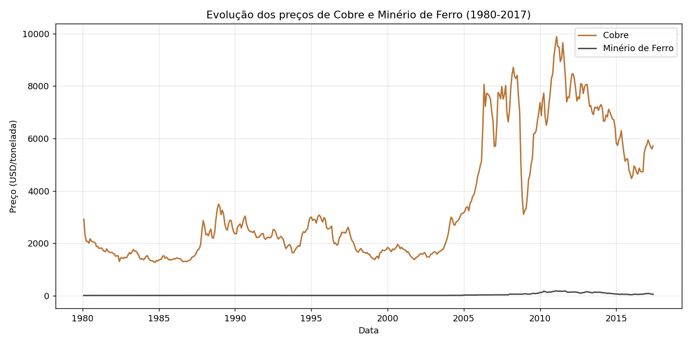
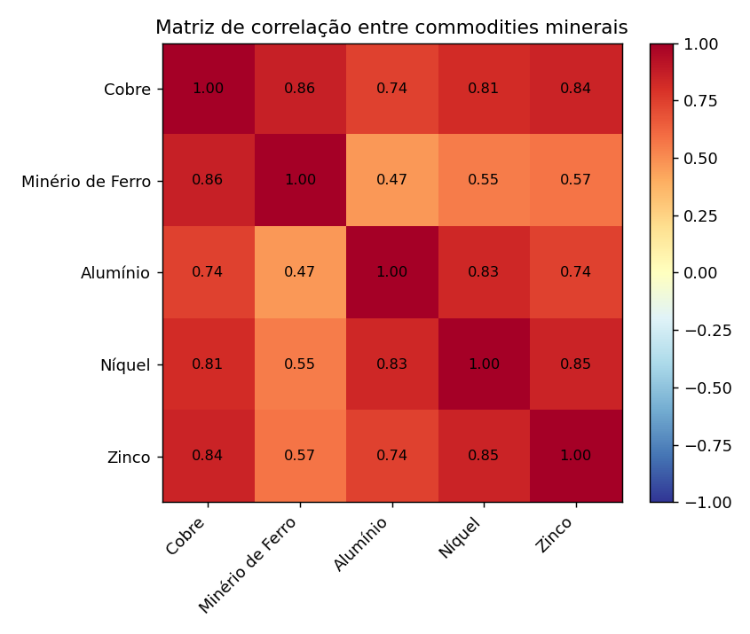
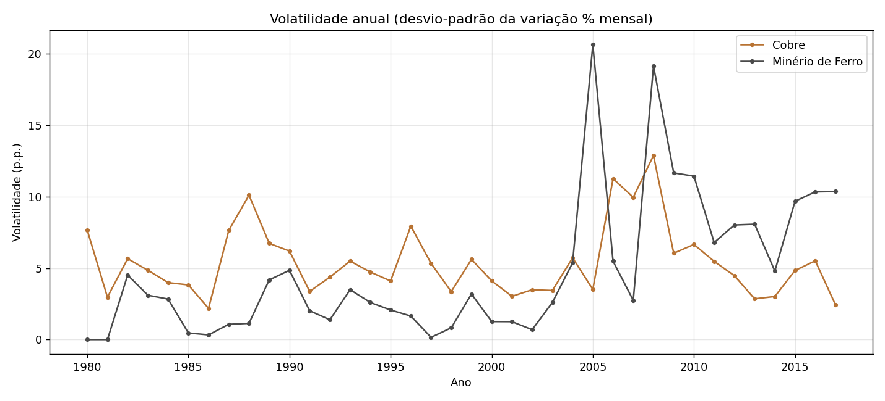
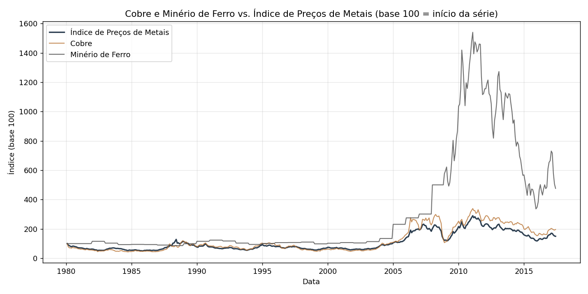

# MVP — Construção de um Pipeline de Dados na Nuvem
### Preços de Commodities Minerais: Cobre e Minério de Ferro

**Autora:** Amanda — Gerência de Perfuração e Desmonte, Vale S.A. (Salobo Metais)
**Curso:** Pós-graduação PUC-Rio — Engenharia de Dados
**Plataforma:** Databricks Free Edition

---

## Sumário

1. [Contexto de Negócios e Perguntas (Etapas 2 e 4.1)](#1-contexto-de-negócios-e-perguntas-etapas-2-e-41)
2. [Carga dos Dados (Etapa 4.2)](#2-carga-dos-dados-etapa-42)
3. [Modelagem e Catálogo de Dados (Etapa 4.3)](#3-modelagem-e-catálogo-de-dados-etapa-43)
4. [Pipeline de Dados (Etapa 4.4)](#4-pipeline-de-dados-etapa-44)
5. [Qualidade de Dados (Etapa 4.5)](#5-qualidade-de-dados-etapa-45)
6. [Análise de Dados (Etapa 4.5)](#6-análise-de-dados-etapa-45)
7. [Autoavaliação](#7-autoavaliação)

---

## 1. Contexto de Negócios e Perguntas (Etapas 2 e 4.1)

### Problema

A Vale é uma das maiores mineradoras do mundo, com forte exposição a **cobre** (produzido na
mina de Salobo, no Pará) e **minério de ferro** (seu principal produto globalmente). O preço
dessas commodities no mercado internacional é o principal driver de receita da companhia e
está sujeito a ciclos globais de oferta e demanda difíceis de antecipar.

**Problema a ser resolvido:** entender como os preços internacionais do cobre e do minério de
ferro se comportaram historicamente, se eles se movem de forma correlacionada entre si e com
o mercado de metais em geral, e em que momentos ocorreram as maiores oscilações — como
referência para discussões de planejamento e gestão de risco de preço.

### Perguntas de negócio

1. Como evoluíram os preços do cobre e do minério de ferro ao longo do tempo?
2. Existe correlação entre o preço do cobre e do minério de ferro?
3. Qual a volatilidade mensal de cada commodity mineral, e em que períodos ela foi mais alta?
4. O cobre e o minério de ferro acompanham o Índice de Preços de Metais (benchmark geral de
   mercado)?
5. Quais foram os maiores picos e quedas percentuais mês a mês, e é possível relacioná-los a
   eventos de mercado conhecidos?

### Fonte dos dados e licença

- **Fonte:** [Commodity Prices](https://github.com/datasets/commodity-prices), dataset mantido
  pelo projeto Frictionless Data / datasets.datahub.io, com dados originais publicados pelo
  **Fundo Monetário Internacional (FMI)**.
- **URL do arquivo usado:** `https://raw.githubusercontent.com/datasets/commodity-prices/main/data/commodity-prices.csv`
- **Conteúdo bruto:** série mensal (fev/1980 a jun/2017), 449 linhas × 64 colunas, com preços e
  índices de 53 commodities e 10 índices agregados.
- **Colunas selecionadas para este MVP:** `Date`, `Metals Price Index`, `Copper`,
  `China import Iron Ore Fines 62% FE spot`, `Aluminum`, `Nickel`, `Zinc` — as commodities
  minerais mais diretamente ligadas ao negócio da Vale, mais o índice geral de metais como
  referência.
- **Licença:** dados do FMI, com uso permitido para fins pessoais e não comerciais (ver
  [Copyright and Usage do FMI](http://www.imf.org/external/terms.htm)). Por não permitir
  redistribuição, **os dados brutos não são versionados neste repositório** (conforme item 4
  da especificação do MVP, isso não é obrigatório) — apenas o link da fonte e os notebooks que
  o baixam/processam.

---

## 2. Carga dos Dados (Etapa 4.2)

Como o dataset já está disponível como um único arquivo CSV público (não foi necessário
scraping nem chamadas de API), a carga seguiu o "caso simples" descrito na especificação:

1. Download do arquivo `commodity-prices.csv` diretamente da URL pública acima.
2. Upload do arquivo para um **Volume do Unity Catalog** no Databricks
   (`/Volumes/workspace/mvp_vale_commodities/bronze_raw/`), via Catalog Explorer.
3. Leitura do arquivo no notebook [`00_ingestao_bronze.py`](00_ingestao_bronze.py),
   com `spark.read.csv(...)`, e persistência como tabela Delta `bronze_commodity_prices_raw`,
   sem nenhuma transformação de valor — apenas dois metadados de controle adicionados
   (`_ingestion_timestamp` e `_source`).

Não houve necessidade de anonimização: os dados são públicos e de mercado (preços de
commodities), sem qualquer informação pessoal ou sensível.
> célula de leitura do CSV bruto + contagem de linhas


> (notebook `00_ingestao_bronze.py`).*

>  *Espaço reservado para screenshot: Catalog Explorer mostrando a tabela


> `bronze_commodity_prices_raw`*


---

## 3. Modelagem e Catálogo de Dados (Etapa 4.3)

### Modelo escolhido: Esquema Estrela (Star Schema)

Optou-se por um esquema estrela simples: uma dimensão (`gold_dim_commodity`) e três tabelas
fato (`gold_fato_precos_mensais`, `gold_fato_precos_anuais`, `gold_fato_variacao_mensal`),
todas derivadas da camada Silver.

```
                     ┌──────────────────────┐
                     │  gold_dim_commodity  │
                     │  (commodity_id PK)   │
                     └──────────┬───────────┘
                                │
             ┌──────────────────┼──────────────────┐
             │                  │                   │
┌────────────▼───────────┐ ┌────▼─────────────┐ ┌───▼──────────────────────┐
│ gold_fato_precos_       │ │ gold_fato_precos_ │ │ gold_fato_variacao_      │
│ mensais (grão: data ×   │ │ anuais (agregado  │ │ mensal (variação % mês   │
│ commodity)              │ │ por ano)          │ │ a mês, via window LAG)   │
└──────────────────────────┘ └───────────────────┘ └───────────────────────────┘
```

A estrutura completa das tabelas (colunas, tipos, domínios de valores e linhagem) está
documentada no **Catálogo de Dados**: [`catalogo_de_dados.md`](catalogo_de_dados.md).

> 📸 *Espaço reservado para screenshot: Catalog Explorer do Databricks mostrando o schema
> `mvp_vale_commodities` com as tabelas Bronze, Silver e Gold.*
> 


---

## 4. Pipeline de Dados (Etapa 4.4)

O pipeline foi implementado em **4 notebooks PySpark/SQL separados**, um por etapa da
arquitetura medalhão + modelagem, para manter cada responsabilidade isolada e facilitar
depuração/reexecução independente. A ordem de execução é sequencial:

| Ordem | Notebook | Responsabilidade |
|---|---|---|
| 1 | [`00_ingestao_bronze.py`](00_ingestao_bronze.py) | Lê o CSV bruto do Volume e persiste como Delta (Bronze), sem alterar valores |
| 2 | [`01_transformacao_silver.py`](01_transformacao_silver.py) | Seleciona colunas relevantes, tipa, remove duplicatas e preços negativos (Silver) |
| 3 | [`02_modelagem_gold.py`](02_modelagem_gold.py) | Constrói o esquema estrela: dimensão + 3 fatos (Gold) |
| 4 | [`03_qualidade_dados.py`](03_qualidade_dados.py) | Valida completude, consistência, unicidade, acurácia e outliers |
| 5 | [`04_analise_e_respostas.py`](04_analise_e_respostas.py) | Responde às 5 perguntas de negócio da Etapa 4.1 |

Cada transformação relevante está documentada com células `%md` dentro do próprio notebook,
explicando o que foi feito, por que foi feito e qual o impacto nos dados — por exemplo, a
remoção de duplicatas de data e a exclusão de preços negativos no notebook Silver.

O código completo está disponibilizado no repositório GitHub público:
**`(https://github.com/Amandaheloise/mvp_databricks_commodities.git)>`**

> 📸 *Espaço reservado para screenshot: tabelas Delta persistidas (Silver e Gold) visíveis no
> Catalog Explorer, evidenciando que os dados foram salvos na plataforma de nuvem.*


---

## 5. Qualidade de Dados (Etapa 4.5)

Verificação das 5 dimensões de qualidade solicitadas, implementada no notebook
[`03_qualidade_dados.py`](03_qualidade_dados.py) e comparando Bronze
(449 linhas) com Silver (449 linhas):

| Dimensão | O que foi verificado | Resultado |
|---|---|---|
| **Completude** | % de nulos por coluna de preço na Silver | 0% de nulos em todas as colunas selecionadas |
| **Consistência** | Linhas com data inválida (não convertível para `date`) | 0 linhas descartadas por esse motivo |
| **Unicidade** | Datas duplicadas | 0 duplicatas encontradas (a base já vinha 1 linha por mês) |
| **Acurácia** | Preços negativos (regra de domínio: preço nunca é negativo) | 0 valores negativos encontrados |
| **Outliers** | Variações mensais > 3 desvios-padrão da variação % mensal de cada commodity | Detectados e mantidos — concentrados em out/nov de 2008 (crise financeira) e no início de 2005/2008 (superciclo de commodities); não removidos por serem eventos reais de mercado, não erros de dado |

**Como esses problemas foram considerados na modelagem e no pipeline:** mesmo com a base
chegando praticamente limpa (é uma série curada e amplamente utilizada, publicada pelo FMI),
todas as regras de qualidade foram implementadas como filtros explícitos no notebook Silver
(`isNotNull`, `dropDuplicates`, filtro `>= 0`) — e não apenas verificadas manualmente — para
que o pipeline seja robusto e reprodutível caso a fonte volte a ser atualizada com dados novos
que contenham esses problemas.

> 📸 *Espaço reservado para screenshot: resultados das 5 verificações de qualidade
> (notebook `03_qualidade_dados.py`).*
> 


---

## 6. Análise de Dados (Etapa 4.5)

Análise completa no notebook [`04_analise_e_respostas.py`](04_analise_e_respostas.py).
Resumo das respostas:

**1. Evolução dos preços (1980–2017):** ambos ficam relativamente estáveis até ~2004 e então
disparam no superciclo de commodities (2004–2011). O cobre termina a série **+96%** acima do
início; o minério de ferro, **+376%**.



**2. Correlação Cobre × Minério de Ferro:** **0,86** (forte e positiva). Correlação de cada um
com o Índice de Preços de Metais: Cobre ≈ **0,99**, Minério de Ferro ≈ **0,89**.



**3. Volatilidade mensal:** Níquel é o mais volátil (desvio-padrão ≈ **8,7 p.p.**), seguido de
Minério de Ferro (≈ 6,9 p.p.), Cobre (≈ 6,3 p.p.), Zinco (≈ 6,2 p.p.) e Alumínio, o mais
estável (≈ 5,5 p.p.). Os maiores picos de volatilidade de Cobre e Minério de Ferro coincidem
com 2008.



**4. Cobre e minério de ferro vs. Índice de Preços de Metais:** ambos acompanham o índice de
perto (ver correlações acima e o gráfico normalizado em base 100 abaixo).



**5. Maiores altas e quedas mensais:** as maiores quedas de toda a série ocorrem em
**out/nov de 2008** (Níquel -31,7%, Cobre -29,8%, Zinco -25,3%, Cobre -23,8% no mês seguinte),
coincidindo com o auge da crise financeira global (colapso do Lehman Brothers). As maiores
altas ocorrem em **janeiro de 2005 e janeiro de 2008** no Minério de Ferro (+71,5% e +66,0%),
relacionadas aos reajustes anuais de contratos de minério de ferro durante o superciclo de
commodities puxado pela demanda chinesa.

**Discussão geral:** os dados confirmam que os preços de commodities minerais relevantes para
a Vale se movem de forma fortemente correlacionada entre si e com o mercado global de metais,
respondendo aos mesmos ciclos macroeconômicos. Isso reforça que decisões de planejamento e
gestão de risco de uma operação como a de Salobo não podem tratar o preço do cobre de forma
isolada. Todas as 5 perguntas definidas na Etapa 2 foram respondidas com os dados disponíveis.

> 📸 *Espaço reservado para screenshot: resultados das queries SQL de cada pergunta, direto no
> Databricks (notebook `04_analise_e_respostas.py`).*
> 
> 
> 
> 
< 
< 


---

## 7. Autoavaliação

**Os objetivos foram atingidos?** Sim. As 5 perguntas de negócio definidas na Etapa 2 foram
respondidas com os dados disponíveis, e o pipeline de ponta a ponta (Bronze → Silver → Gold →
qualidade → análise) foi implementado e documentado.

**Dificuldades encontradas:**
- Escolher colunas relevantes em meio a um dataset com 64 colunas (53 commodities + 10
  índices) exigiu voltar à etapa de objetivo várias vezes para não coletar dados
  desnecessários — exatamente o alerta feito na especificação do MVP sobre "ir ao mercado sem
  lista de compras".
- A base, por vir de uma fonte já curada (FMI), apresentou muito poucos problemas de
  qualidade — o que por um lado facilitou o tratamento, mas por outro exigiu esforço extra
  para implementar e testar validações que, na prática, não encontraram muitos erros reais
  (foi necessário simular cenários mentalmente para garantir que o pipeline reagiria
  corretamente se os problemas existissem).

**Trabalhos futuros para enriquecer a solução:**
- Incorporar dados de produção e vendas da própria Vale (relatórios públicos trimestrais) para
  cruzar preço de mercado com volume produzido/vendido.
- Adicionar uma camada de streaming/atualização incremental, já que a fonte atual do FMI é
  atualizada periodicamente — hoje o pipeline sempre recarrega o histórico completo
  (`overwrite`).
- Explorar modelos de série temporal (ex.: ARIMA, Prophet) sobre a tabela `gold_fato_precos_mensais`
  para gerar projeções de curto prazo, indo além da análise descritiva feita neste MVP.

---

## Estrutura do repositório

Todos os arquivos ficam soltos na raiz do repositório (sem subpastas), para simplificar o
upload. Os nomes já indicam a que etapa cada um pertence:

| Arquivo | O que é |
|---|---|
| `README.md` | este arquivo |
| `00_ingestao_bronze.py` | notebook — Etapa 4.2 (Bronze) |
| `01_transformacao_silver.py` | notebook — Etapa 4.4, parte 1 (Silver) |
| `02_modelagem_gold.py` | notebook — Etapa 4.3/4.4, parte 2 (Gold) |
| `03_qualidade_dados.py` | notebook — Etapa 4.5, qualidade de dados |
| `04_analise_e_respostas.py` | notebook — Etapa 4.5, análise final |
| `catalogo_de_dados.md` | catálogo completo (Etapa 4.3) |
| `quality_report.json` | saída numérica da validação de qualidade |
| `analysis_results.json` | saída numérica da análise |
| `correlacao_commodities.csv` | matriz de correlação entre commodities |
| `01_evolucao_cobre_minerio.png` ... `04_vs_indice_metais.png` | gráficos referenciados neste README |
| `local_pipeline_validation.py` | script de validação local (pandas) — ver nota abaixo |

> **Nota sobre `local_pipeline_validation.py`:** este script roda a mesma lógica dos
> notebooks em pandas, localmente, e foi usado para **validar a lógica do pipeline e gerar os
> gráficos deste README** antes da execução real no Databricks. Ele não substitui os
> notebooks PySpark — a entrega oficial do MVP são os 5 notebooks (`00_...` a `04_...`), que
> devem ser importados e executados no Databricks (ver instruções abaixo) para gerar as
> tabelas Delta e os screenshots de evidência pedidos na especificação.
>
> Os dados brutos e derivados (pastas `data/bronze`, `data/silver`, `data/gold` do projeto
> local) não são enviados a este repositório — a licença do FMI não permite redistribuição
> (ver seção 1). Eles servem apenas para uso local, ao rodar o script acima.

